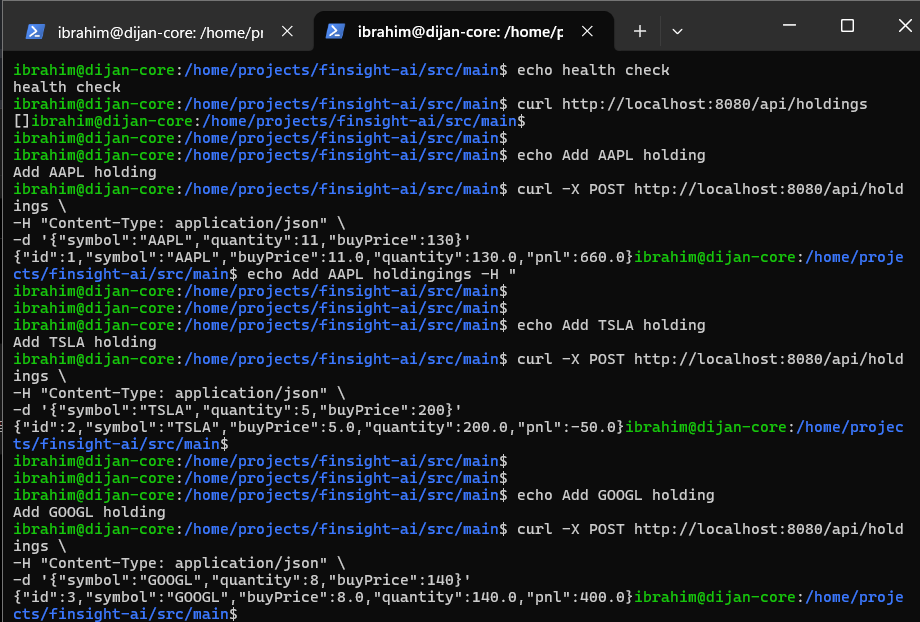
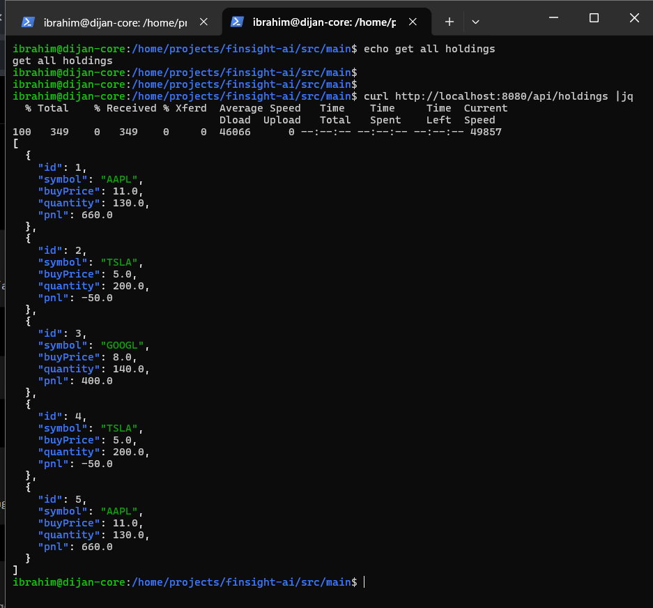
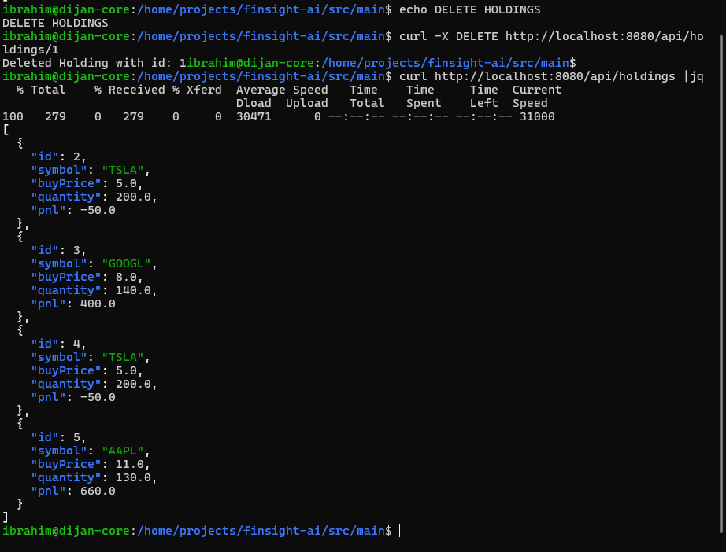
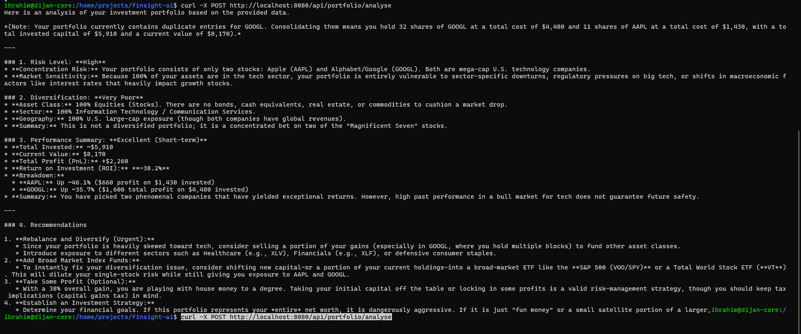

# FinSight AI


FinSight AI is an AI-powered investment portfolio analysis platform built with
Spring Boot. It allows users to manage investment holdings, track portfolio
data, and generate intelligent portfolio insights using Google Gemini AI.

The system demonstrates backend engineering practices including REST API design,
service-layer architecture, database persistence, external API integration,
exception handling, and automated testing.

---

# Features

## Portfolio Management

- Create investment holdings
- Retrieve portfolio holdings
- Delete existing holdings
- Store investment information locally

## AI Portfolio Analysis

- Builds contextual prompts from user holdings
- Sends portfolio data to Google Gemini
- Generates AI-powered investment insights
- Handles AI API failures gracefully

## Backend Engineering

- RESTful API architecture
- Layered Spring Boot design
- Database persistence
- Environment-based configuration
- Global exception handling
- Automated testing

---

# System Architecture

```text
                    Client
                      |
                      |
              REST API Controllers
                      |
        +-------------+-------------+
        |                           |
HoldingController          PortfolioController
        |                           |
        |                           |
HoldingService        PortfolioAnalysisService
        |                           |
        +-------------+-------------+
                      |
              Data Access Layer
                      |
              H2 Database
                      |
              Price Service
                      |
              Gemini Client
                      |
              Google Gemini API
```

## Request Flow

1. Client sends a request to the REST API.
2. Controller validates and routes the request.
3. Service layer handles business logic.
4. Data is stored/retrieved from the database.
5. Portfolio analysis generates an AI prompt.
6. Gemini API processes the request.
7. AI-generated insights are returned to the client.

---

# Technology Stack

## Backend

| Technology | Purpose |
|---|---|
| Java 17 | Programming language |
| Spring Boot | Backend framework |
| Spring Web | REST API development |
| Spring Data JPA | Database interaction |
| Maven | Dependency management |

## Database

| Technology | Purpose |
|---|---|
| H2 Database | Development database |
| JPA/Hibernate | ORM layer |

## AI Integration

| Technology | Purpose |
|---|---|
| Google Gemini API | Portfolio analysis generation |

---

# Project Structure

```
src
├── main
│   ├── java
│   │   └── com.finsight
│   │       ├── controller
│   │       │   ├── HoldingController
│   │       │   └── PortfolioController
│   │       │
│   │       ├── service
│   │       │   ├── HoldingService
│   │       │   └── PortfolioAnalysisService
│   │       │
│   │       ├── client
│   │       │   └── GeminiClient
│   │       │
│   │       ├── repository
│   │       └── model
│   │
│   └── resources
│       └── application.properties
│
└── test
```

---

# Requirements

Before running FinSight AI, install:

- Java 17 or newer
- Maven 3.8+
- Google Gemini API key

Verify Java installation:

```bash
java -version
```

Verify Maven:

```bash
mvn -version
```

---

# Configuration

FinSight AI uses environment variables for sensitive configuration.

## Gemini API Key

The application reads the API key from:

```
GEMINI_API_KEY
```

Set your API key:

```bash
export GEMINI_API_KEY='your-google-gemini-api-key'
```

Verify:

```bash
echo $GEMINI_API_KEY
```

Never commit API keys or secrets into the repository.

---

# Running the Application

## 1. Navigate to Project

Example:

```bash
cd /home/projects/finsight-ai
```

---

## 2. Start Spring Boot Server

Run:

```bash
mvn spring-boot:run
```

The application starts on:

```
http://localhost:8080
```

Expected startup message:

```
Started FinSightAiApplication
Tomcat started on port 8080
```

---

# API Documentation

Base URL:

```
http://localhost:8080/api
```

---

# Holdings API

## Create Holding

Creates a new investment holding.

### Request

```bash
curl -X POST http://localhost:8080/api/holdings \
-H 'Content-Type: application/json' \
-d '{"symbol":"AAPL","quantity":11,"buyPrice":130}'
```

Example response:

```json
{
    "id":1,
    "symbol":"AAPL",
    "quantity":11,
    "buyPrice":130
}
```

---

## Retrieve Holdings

Returns all stored investments.

```bash
curl http://localhost:8080/api/holdings
```

Example response:

```json
[
 {
   "id":1,
   "symbol":"AAPL",
   "quantity":11,
   "buyPrice":130
 }
]
```

---

## Delete Holding

Deletes a holding by ID.

```bash
curl -X DELETE http://localhost:8080/api/holdings/1
```

---

# AI Portfolio Analysis API

Generates AI-based portfolio insights.

## Request

```bash
curl -X POST http://localhost:8080/api/portfolio/analyse
```

## Processing Flow

```
Stored Holdings
       |
       |
PortfolioAnalysisService
       |
       |
Prompt Generation
       |
       |
Gemini API
       |
       |
AI Investment Analysis
```

---

# Testing

Run automated tests:

```bash
mvn test
```

Tests include:

- Service validation
- Controller behaviour
- API functionality

---

# Error Handling

FinSight AI implements global exception handling.

API errors are returned in JSON format:

Example:

```json
{
 "timestamp":"2026-08-04T12:00:00",
 "status":500,
 "message":"Gemini API request failed"
}
```

Handled scenarios:

- Invalid requests
- Missing data
- External API failures
- Database errors

---

# Security Considerations

Implemented:

- Environment-based secrets
- No hardcoded API credentials
- Controlled external API access

Recommended production improvements:

- Replace H2 with PostgreSQL
- Add authentication using JWT/OAuth2
- Add rate limiting
- Add API monitoring
- Containerize with Docker
- Deploy behind Nginx

---
# Demo Screenshots

## Health check and adding Holdings

The Spring Boot application successfully starts and runs on port `8080`.



---

## Portfolio Management API

retrieving investment holdings through the REST API.



---

## Portfolio management - DELETE

Deleting investment holdings through the REST API using ID.

 

## AI Portfolio Analysis

Generating portfolio insights using Google Gemini AI.



# Production Deployment Roadmap

Future production architecture:

```
                Users
                  |
                Nginx
                  |
          Spring Boot Application
                  |
        +---------+---------+
        |                   |
   PostgreSQL          Redis Cache
        |
        |
   Gemini AI Service
```

---

# Troubleshooting

## Gemini API Key Not Found

Check:

```bash
echo $GEMINI_API_KEY
```

Restart application after updating:

```bash
mvn spring-boot:run
```

---

## Port 8080 Already Used

Find process:

```bash
lsof -i :8080
```

Terminate:

```bash
kill -9 <PID>
```

---

# Author

**Abdifatah Ibrahim**

GitHub:
```
@jjibrah
```

Email:
```
ibrabdi109@gmail.com
```

---

# Notes

- Maven generated files are excluded using `.gitignore`.
- Never commit environment variables or API keys.
- This project demonstrates production backend patterns using Spring Boot and AI integration.
